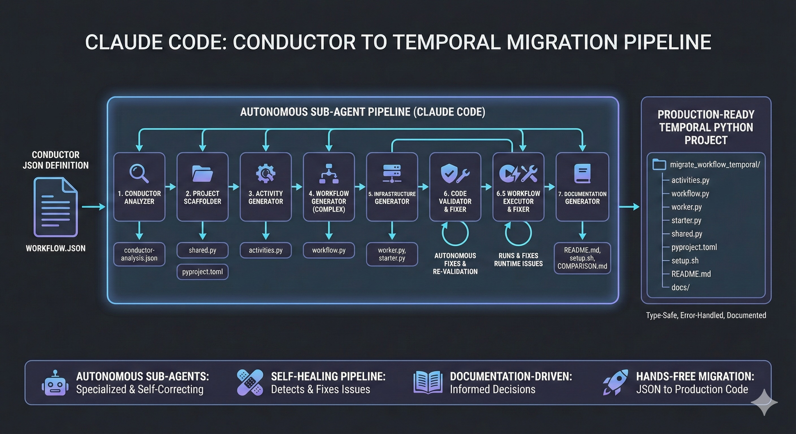

# Temporal Conductor Migration Agent Template

**Automatically convert Netflix Conductor workflows to Temporal Python projects using Claude Code.**

[](./diagram.jpg)

**⚠️ NOTE:** This agent can run for 30+ minutes and cost many Anthropic tokens (80k+)!

**⚠️ NOTE:** The agent will ask you to approve _many_ tools and code generations along the way. I would _never_ recommend doing this outside of a sandbox environment but _if you wanted to_, run `claude --dangerously-skip-permissions` to ensure the agent cooks without interruption 🍳

Migrated project examples:
* Temporal Document Approvals. [Readme](https://github.com/steveandroulakis/temporal-conductor-migration-agent/blob/claude_test2/PROJECT_README.md) // [Code](https://github.com/steveandroulakis/temporal-conductor-migration-agent/tree/claude_test2/schema_approval_temporal). Based off the Conductor [document approvals example](https://github.com/conductor-sdk/conductor-examples/tree/main/document_approvals).
* Temporal Insurance Claim Processing. [Readme](https://github.com/steveandroulakis/temporal-conductor-migration-agent/blob/insurance-claim/PROJECT_README.md) // [Code](https://github.com/steveandroulakis/temporal-conductor-migration-agent/tree/insurance-claim/insurance_claim_temporal). Based off the Conductor [insurance claim processing example](https://github.com/conductor-oss/awesome-conductor-apps/blob/960afd67a4858f28ba5ad711492748f0fb91e07a/typescript/claims-workflow/workflows/claim_workflow.json#L2)
* Temporal Agentic Security. [Code](https://github.com/steveandroulakis/temporal-conductor-migration-agent/blob/example-agentic-security-2/agentic_security_example_temporal/workflow.py). Based off the Conductor [agentic security example](https://github.com/conductor-oss/awesome-conductor-apps/tree/960afd67a4858f28ba5ad711492748f0fb91e07a/examples/agentic_security_workflow)
* Temporal OSS HTTP workflow example [Readme](https://github.com/steveandroulakis/temporal-conductor-migration-agent/blob/OSS-HTTP-workflow/PROJECT_README.md) // [Code](https://github.com/steveandroulakis/temporal-conductor-migration-agent/blob/OSS-HTTP-workflow/fetch_users_temporal/workflow.py)
  Based off the Conductor [OSS HTTP workflow example](https://gist.github.com/ashutoshsahoo/8588009c0c3c4bf835f534e4ab7e1b09#file-netflix_conductor_oss_http_workflow_example-md)
* Temporal Shopping Cart. [Readme](https://github.com/steveandroulakis/temporal-conductor-migration-agent/blob/claude_test3/PROJECT_README.md) // [Code](https://github.com/steveandroulakis/temporal-conductor-migration-agent/tree/claude_test3/shopping_cart_temporal). Based off the Conductor [shopping cart example](https://github.com/conductor-sdk/conductor-examples/tree/main/shopping_cart).
* Temporal Check Address (USPS). [Readme](https://github.com/steveandroulakis/temporal-conductor-migration-agent/blob/claude_test4/PROJECT_README.md) // [Code](https://github.com/steveandroulakis/temporal-conductor-migration-agent/tree/claude_test4/check_address_temporal). Based off the Conductor [USPS check address example](https://github.com/conductor-sdk/conductor-examples/tree/main/US_post_office)

## What the agent does

This Claude Code project provides a 8-agent sequential pipeline that:
1. Analyzes Conductor JSON workflow definitions
2. Generates complete, production-ready Temporal Python projects with:
   - Type-safe activities and workflows
   - Worker and starter scripts
   - Comprehensive documentation
   - Automated setup scripts
3. Validates all generated code, runs it, and autonomously fixes issues
4. Uses the [Temporal skill](.claude/skills/temporal/SKILL.md) to manage workflow execution, monitoring, and troubleshooting throughout the migration process

## Quick Start

### Prerequisites
- [Claude Code](https://claude.ai/claude-code)
- Python 3.11+
- [UV package manager](https://github.com/astral-sh/uv)
- [Temporal CLI](https://temporal.io/download)

### Step 1: Create Your Repository

1. Click the **"Use this template"** button at the top of this repository
2. Give your new repository a name (e.g., `migrate-my-workflow`)
3. Clone your new repository locally

### Step 2: Add your Conductor Workflow
Place your Conductor JSON workflow in:
   ```bash
   cd conductor-definition
   # Add your Conductor workflow.json here
   # REPLACE the example json
   # ENSURE YOU HAVE A SINGLE CONDUCTOR PROJECT IN THIS DIRECTORY
   ```

### Step 3: Run Migration Command
In Claude Code, execute:
```
/migrate-conductor
```

OR with optional context/requirements, for example:
```
/migrate-conductor My USPS username is steveandroulakis. If API calls fail, use mock responses as placeholders.
```
The arguments you provide will be passed to all agents in the pipeline, informing their code generation decisions.

The pipeline will automatically:
- Analyze your Conductor workflow
- Generate a complete Temporal Python project
- Use your provided context to guide activity implementations
- Validate and fix any issues
- Create comprehensive documentation

### After Migration
Your generated project will include:
- `{workflow_name}_temporal/` - Complete Python package
- `setup.sh` - Automated setup script
- ...and comprehensive markdown documentation on running the project.

## Architecture

See [CLAUDE.md](./CLAUDE.md) for complete pipeline architecture and agent specifications.

- `conductor-migration/` - Comprehensive migration guides
- `.claude/` - Subagents and migration command

## Future work
- Refinements to subagents (maybe speed it up a bit?)
- Test with many more conductor workflow types
- I should generate tests!
- Ensure the resulting docs aren't written all over the repo (better file organization)

---

**Generated projects are production-ready with type safety, error handling, and comprehensive documentation.**
